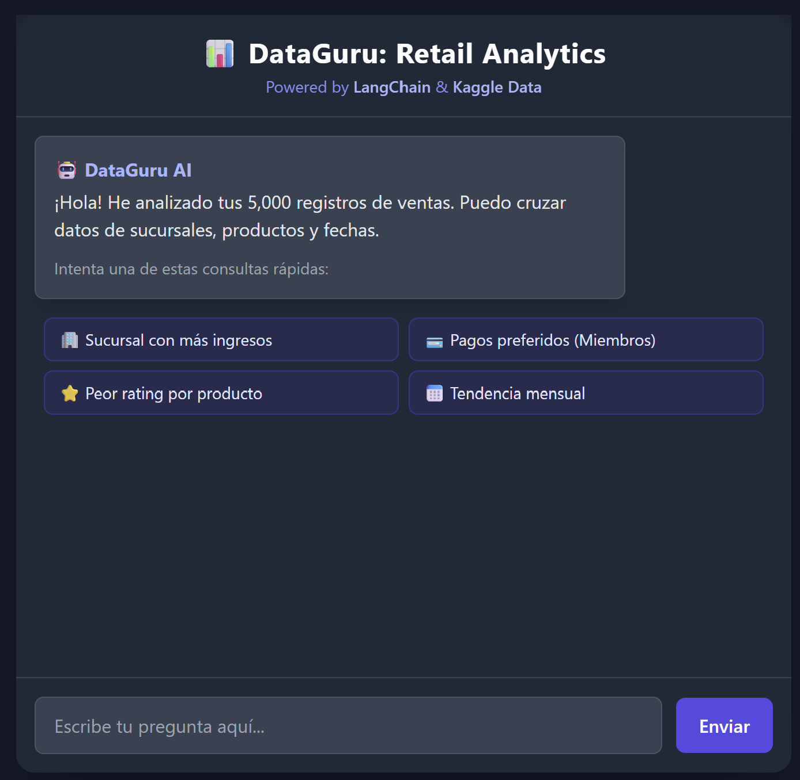

# 📊 DataGuru: Agente de Analytics con IA (Text-to-SQL)


> **Convierte lenguaje natural en consultas SQL complejas en segundos.** > Una herramienta diseñada para democratizar el acceso a datos de ventas retail, permitiendo a usuarios no técnicos "chatear" con una base de datos de +5,000 registros.

---

## 📸 Demo & Capturas



[**🌐 Ver Proyecto Desplegado (Live Demo)**](https://agente-sql-app.vercel.app/)

---

## 🚀 Descripción del Proyecto

Esta aplicación full-stack simula el rol de un Analista de Datos Senior. Utiliza Modelos de Lenguaje (LLMs) para interpretar preguntas de negocio, transformarlas en sentencias SQL sintácticamente correctas, ejecutarlas sobre una base de datos real y explicar los resultados.

**Características Clave:**
* **RAG (Retrieval Augmented Generation):** Conecta GPT/Gemini con datos privados.
* **Dataset Real:** Entrenado/Probado con el dataset "Supermarket Sales" de Kaggle (+5k filas).
* **Seguridad:** Ejecución de consultas en entorno controlado (solo lectura/análisis).
* **UX Intuitiva:** Sugerencias inteligentes (Chips) y diseño responsivo.

---

## 🧠 Stack Tecnológico

### Backend (La "Cocina")
* **Python & FastAPI:** API REST de alto rendimiento.
* **LangChain:** Orquestación del agente y cadenas de pensamiento (Chain of Thought).
* **Google Gemini Pro:** El cerebro (LLM) detrás del razonamiento SQL.
* **Pandas & SQLite:** Manejo de datos y motor SQL en memoria.

### Frontend (El "Comedor")
* **HTML5 & JavaScript (ES6+):** Sin frameworks pesados, puro rendimiento.
* **Tailwind CSS:** Diseño moderno y adaptativo.

---

## ⚙️ Arquitectura del Sistema

El flujo de datos sigue una arquitectura moderna de IA:

```mermaid
graph LR
    A[Usuario] -->|Pregunta Natural| B(Frontend JS)
    B -->|JSON| C{FastAPI Backend}
    C -->|Prompt| D[LangChain Agent]
    D -->|Genera SQL| E[(Base de Datos SQLite)]
    E -->|Resultados| D
    D -->|Respuesta Explicada| C
    C -->|Respuesta Final| A